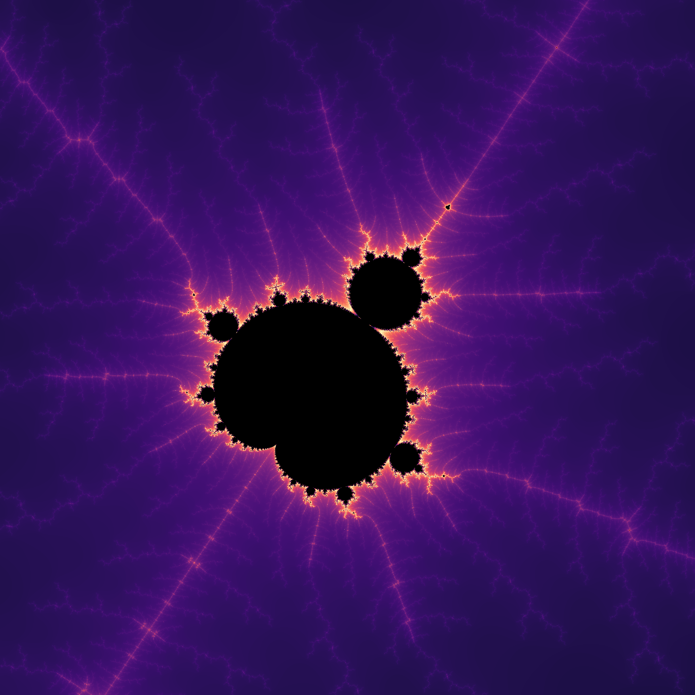

Interactive Fractal Explorer
==============================


Features
--------
* Interactive
* Cuda processing
* Colormapping
* Multiple fractals:
  * [Mandelbrot](https://en.wikipedia.org/wiki/Mandelbrot_set)
  * [Burning ship](https://en.wikipedia.org/wiki/Burning_Ship_fractal)

Executing
--------
The program can either be run by command-line execution or within an IDE.

#### Command-line execution:
run `py fractal.py`

optional arguments:
*  -h, --help            
show help message and exit
*  -f  
fractal set to generate from {'burningship', 'mandelbrot'}
*  -i  
maximum iterations
*  -c  
starting coordinates xmin, xmax, ymin, ymax separated by spaces. e.g. `py fractal.py -c -2.5 1.5 -2.0 2.0`
*  -r  
resolution of window

Example:
`py fractal.py -r 1280 -f burningship -c -1.8 -1.7 -0.01 0.09`

#### Within an IDE:
run `main()` within `fractal.py`

All parameters are optional. The defaults are:  
`fractal='mandelbrot'`  
`iterations=1500`  
`resolution=1000`  
`coords=(-2.5, 1.5, 2.0, 2.0)`

Here is an example of executing with custom parameters:
```python
    main(fractal='burningship',
         iterations=2500,
         resolution=720,
         coords=(-1.8, -1.7, -0.01, 0.09))
```

Controls
--------
##### (All controls take place on cursor position)
* Left-click: zoom in
* Right-click: zoom out
* Middle-mouse: relocate center

Requirements
------------
Python 3.8 or later

For module requirements see [requirements.txt](https://github.com/wephy/py-fractals/blob/main/requirements.txt)
> NOTE: Testing has only been with Python 3.8+

To-do
------
* Add more fractal sets
* Add smooth zoom animation
* Add regular jit and/or cuda emulation fallback for cuda incompatible systems
* Add menu screen (for entering fractal, resolution, colormap, max iterations, etc.) => turn into executable
* Add additional controls (e.g. return to original position)

License
-------
Fractal Explorer is licensed under the terms of the [Apache 2.0 License](http://www.apache.org/licenses/LICENSE-2.0)
